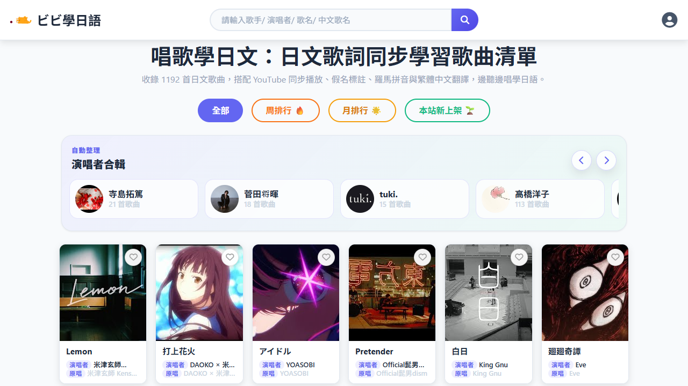
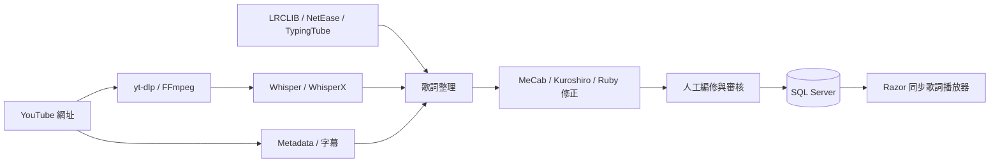

<p align="center">
  
</p>

# LearnMore

[](https://github.com/NickYCLin/learnmore/actions/workflows/ci.yml)
[](LICENSE)

以日文歌曲練聽力與跟唱，把同步歌詞、漢字注音（Ruby／Furigana）、羅馬拼音、繁體中文翻譯、卡拉 OK 與語音辨識整理在同一個網站。

LearnMore is an ASP.NET Core Japanese song learning web app with synchronized lyrics, furigana, romaji, Traditional Chinese translations, karaoke, and Whisper-based speech-to-text.



[線上使用 LearnMore](https://magicplus-design.serveirc.com/LearnMore) · [閱讀程式架構](docs/ARCHITECTURE.md) · [開始本機開發](#本機開發)

## 這個專案在做什麼

LearnMore 不只是歌詞播放器，也包含從歌曲資料建立、字幕與歌詞來源整合、語音辨識、日文讀音產生，到人工校正與審核的完整流程。

- 依 YouTube 播放時間同步顯示日文、中文、Ruby 注音與 Roman。
- 提供卡拉 OK、逐句練習、歌曲群組、個人收藏與行動版播放介面。
- 整合 YouTube 字幕、LRCLIB、NetEase、TypingTube 與 Whisper 歌詞來源。
- 使用 MeCab、Kuroshiro、Kuromoji 與專案修正規則產生日文讀音。
- 支援歌曲召喚、歌詞編修、審核佇列與高精度時間軸對齊。
- 透過 FFmpeg、yt-dlp 與 Demucs 處理音訊下載及人聲／伴奏分離。
- 支援 Google 登入、歌曲管理、願望清單、留言、收藏與使用者設定。

## 核心資料流程



## 技術組成

| 範圍 | 技術 |
| --- | --- |
| Web | .NET 8、ASP.NET Core MVC、Razor Views、JavaScript、Bootstrap |
| 資料 | SQL Server、ADO.NET |
| 日文處理 | MeCab、Kuroshiro、Kuromoji |
| 語音與音訊 | OpenAI Whisper、faster-whisper、WhisperX、FFmpeg、yt-dlp、Demucs |
| 外部歌詞來源 | YouTube 字幕、LRCLIB、NetEase、TypingTube |
| 驗證 | xUnit、Playwright、服務與畫面契約測試 |

## 從哪裡開始看程式碼

| 想了解的內容 | 建議入口 |
| --- | --- |
| 啟動、DI、Middleware、背景服務 | [`LearnMore/Program.cs`](LearnMore/Program.cs) |
| 首頁、搜尋與歌曲清單 | [`LearnMore/Controllers/HomeController.cs`](LearnMore/Controllers/HomeController.cs) |
| 同步歌詞與練習模式 | [`LearnMore/Controllers/LyricsController.cs`](LearnMore/Controllers/LyricsController.cs) |
| 上傳、編修、審核與轉錄流程 | [`LearnMore/Controllers/MediaController.cs`](LearnMore/Controllers/MediaController.cs) |
| Whisper 工作流程 | [`LearnMore/Services/WhisperTranscribeWorkflowService.cs`](LearnMore/Services/WhisperTranscribeWorkflowService.cs) |
| 日文 Ruby 產生與清理 | [`LearnMore/Services/JapaneseRubyGeneratorService.cs`](LearnMore/Services/JapaneseRubyGeneratorService.cs) |
| 音軌分離背景工作 | [`LearnMore/Services/AudioStemProcessingHostedService.cs`](LearnMore/Services/AudioStemProcessingHostedService.cs) |
| 測試案例 | [`LearnMore.Tests`](LearnMore.Tests) |

更完整的模組、資料流與修改入口整理在 [`docs/ARCHITECTURE.md`](docs/ARCHITECTURE.md)。

## iOS App（開發中）

原生 SwiftUI 專案位於 [`ios/`](ios/README.md)，目標為 App Store 發佈，透過現有 .NET 後端共用線上資料。已建立歌曲搜尋與歌詞閱讀；會員收藏、原生同步播放與送審準備尚待完成。新增 mobile API 需部署後才可連線使用。

## 專案結構

```text
LearnMore/
├─ Controllers/       MVC 頁面與 API 入口
├─ Services/          歌詞、轉錄、日文處理與背景工作
├─ Models/            頁面與流程資料模型
├─ Views/             Razor Views
├─ Scripts/           Whisper / WhisperX 輔助程式
└─ wwwroot/           JavaScript、CSS、圖示與前端套件
LearnMore.Tests/      xUnit 與畫面契約測試
docs/                 架構與程式碼導覽
```

## 本機開發

### 需求

- .NET 8 SDK
- SQL Server
- Node.js 20 以上
- FFmpeg 與 yt-dlp

本機高精度辨識或音軌分離另需 Python、faster-whisper、WhisperX 或 Demucs；不使用這些功能時可以先不設定。

### 1. 還原前端套件

```powershell
npm ci --prefix LearnMore/wwwroot/js
```

### 2. 建立本機設定

```powershell
Copy-Item LearnMore/appsettings.Local.example.json LearnMore/appsettings.Local.json
```

填入本機 SQL Server 連線資訊，需要使用外部服務時再設定對應金鑰。`appsettings.Local.json` 已被忽略，請勿提交任何正式憑證。

### 3. 還原與測試

```powershell
dotnet restore LearnMore.sln
dotnet test LearnMore.sln
```

### 4. 啟動網站

```powershell
dotnet run --project LearnMore/LearnMore.csproj
```

完整啟動需要相容的 SQL Server schema；正式站的歌曲、歌詞、會員、留言與憑證不包含在公開倉庫中。

## 公開範圍與授權

這個倉庫公開應用程式原始碼與測試，但不包含正式環境設定、Cookie、API Key、資料庫備份、完整歌曲歌詞、翻譯資料及使用者內容。第三方套件與日文字典依各自附帶的授權條款使用。

除另有註明外，本專案自行撰寫的原始碼與文件採 [MIT License](LICENSE)。第三方函式庫、IPADIC 字典、專案視覺素材，以及歌曲、歌詞、翻譯、封面與影音內容不一定適用 MIT，詳細範圍請參閱 [`THIRD_PARTY_NOTICES.md`](THIRD_PARTY_NOTICES.md)。
